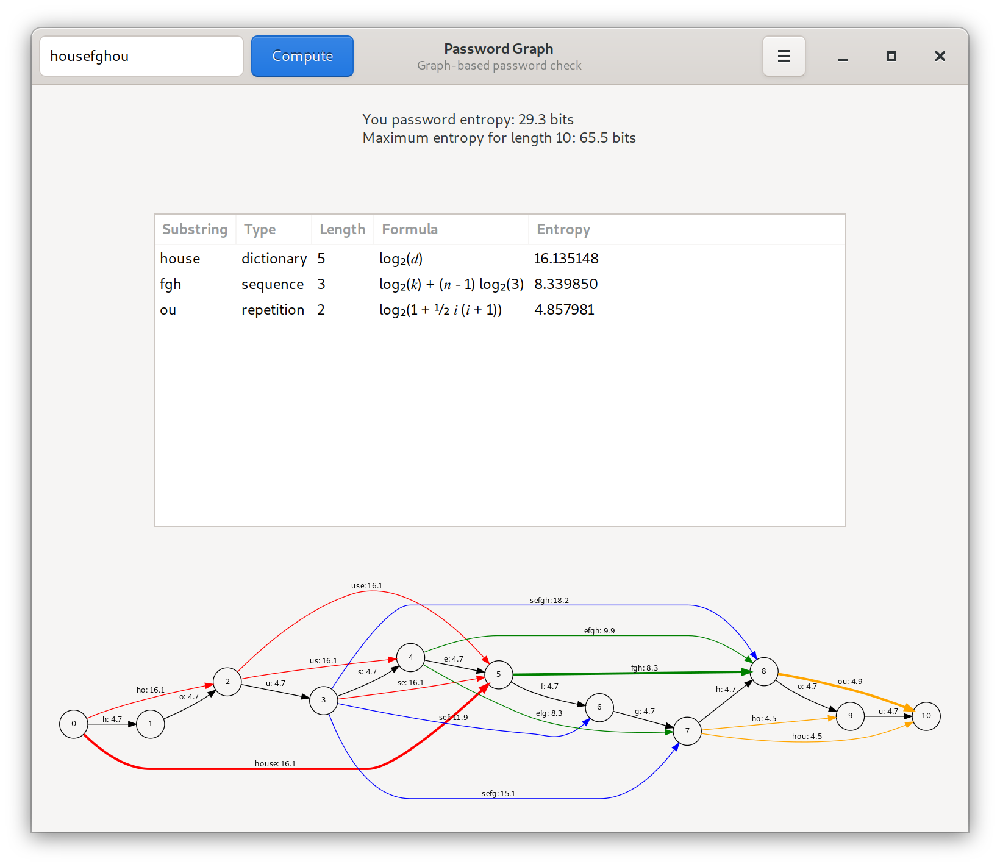

# Password Graph

Graph-based password check

## How does it work?

The graph-based password check works as follows:
1. Find all non-random substrings of the password:
  - dictionary words (English only)
  - keyboard patterns
  - sequences (numbers, alphabetical)
  - repetitions (strings that occured in the password before)
2. Put all single characters as well as discovered substrings into a digraph (directed graph).
3. Annotate all edges with an estimated entropy.
3. Find the path with the shortest entropy.

This method is meant to simulate the worst case, i.e. that the attacker already knows the victim's language etc. Only “true randomness” that the attacker provably cannot know will contribute to password strength.

## Build and install

Build Dependenices:
- gnome-devel

Runtime Dependencies:
- graphviz

### Debian/Ubuntu
~~~~
# apt install gnome-devel graphviz

$ git clone https://github.com/erlenmayr/pwgraph
$ cd pwgraph/
$ meson build
$ ninja -C build
$ ninja -C build install
~~~~

## Screenshots

## CGI Version

A past CGI version can be found here:

https://verbuecheln.ch/pwgraph.html (IPv6 only)

